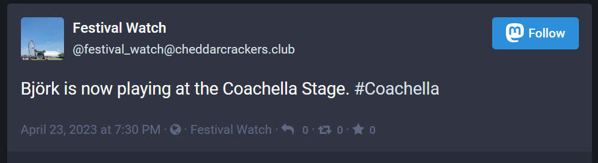
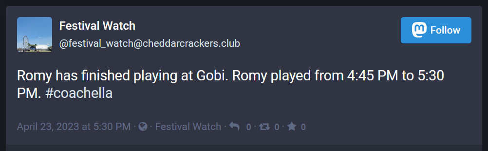
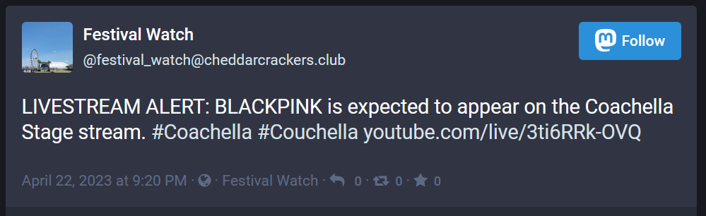
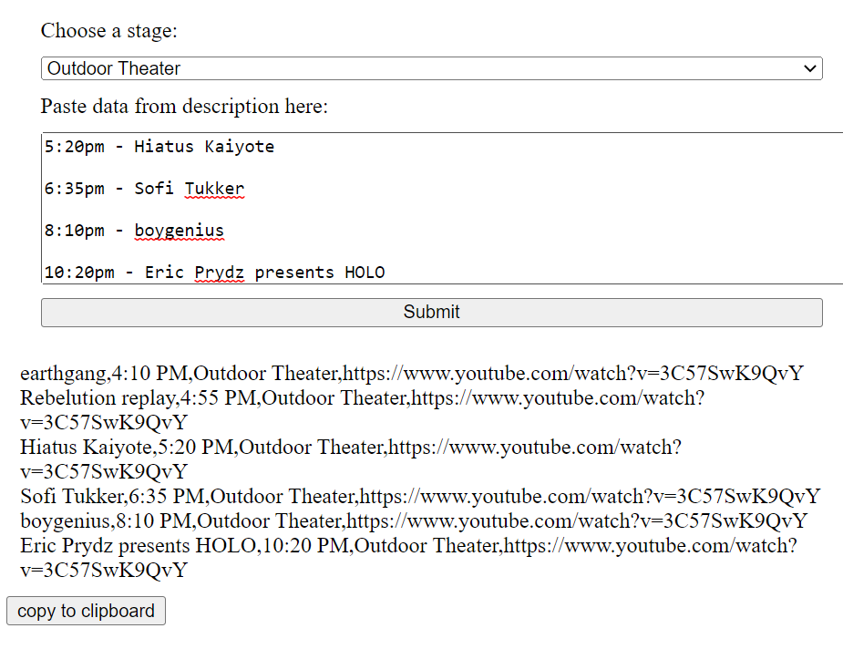

# Festival_Watch

A Mastodon bot to track when and where an artist is performing at Coachella 2023.

Follow here: [@festival_watch@cheddarcrackers.club](https://cheddarcrackers.club/web/@festival_watch)

## Why?

Coachella is a massive music festival that spans two weekends. There are hundreds of artists playing. This year, there were six concurrent livestreams that were broadcasting performances throughout the weekend. Trying to keep track of it all can be overwhelming. Helpful users on Reddit have made spreadsheets and images that can help plan out a weekend, but it is still easy for acts to slip under the radar. This bot posts a feed of all activity at the festival as it is scheduled to happen to help increase awareness of performances.

## Example Posts

### Now playing alert 

### Finished playing alert

### Livestream alert

## Additional Features

- A static webpage tool that allows me to generate CSV data by copying/pasting data from the YouTube livestream description or Reddit livestream discussion threads.

 

- GitHub Workflows to allow me to run this bot remotely. The livestream schedules for all of Weekend 2 dropped before I arrived at the festival grounds so I never got to use this feature outside of testing.

- Not really a feature, but the included CSV files contain the data used to create the posts this bot made. This is probably the most interesting part of this repo.

## Improvements

Here are some improvements that I want to make for next year:

- Better grammar on posts.
- Additional data about whether an artist has performed at the festival before.
- Smoother execution. This was my first attempt at building at Mastodon bot. It was hastily put together the night before the festival when I thought this might be a useful idea. I think some simple refactoring could go a long way.
- Fix the following error caused by accent marks:

`
File "C:\Python310\lib\encodings\cp1252.py", line 23, in decode
    return codecs.charmap_decode(input,self.errors,decoding_table)[0]
UnicodeDecodeError: 'charmap' codec can't decode byte 0x8d in position 263: character maps to <undefined>
`

## Notes

This bot schedules hundreds of posts a day during the festival. By default Mastodon only allows 25 scheduled posts per day. As the owner of the Mastodon instance this bot is hosted on, I modified the Mastodon source code to increase the number of posts that can be scheduled. It's a simple adjustment that is [explained here](https://gist.github.com/judog24/0a4d28c1b263b0f89ae7d337bc626804).
